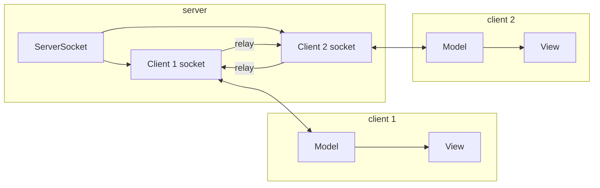

# Battleship


## How to run

1. Compile everything from this folder:
   ```bash
   cd BattleshipGame
   javac *.java
   ```

2. Start the server (one terminal):
   ```bash
   java Server
   ```

3. Start two clients (two more terminals, or run the same command twice):
   ```bash
   java Client
   ```
   To connect to another machine: `java Client <serverIP>`

4. In each client window: click **Play Game**, then take turns clicking a cell on the grid to shoot. Red = hit, gray = miss.

## What each file is for

| File | Purpose |
|------|--------|
| **Server.java** | Waits for two players, sends each a player index (0 or 1), then relays every message from one client to the other. No game logic here. |
| **Client.java** | Connects to the server, reads player number, creates the Model and View, and starts the thread that listens for the opponent’s shots. |
| **Model.java** | Holds game state: your board (ships), their board (hit/miss), and your hits (when they shoot at you). Handles `shoot()` and `waitForOpponent()` using the network streams. |
| **View.java** | The window: grid, ship squares, shot markers, score, log, and Play Game button. Gets all data from the model and calls the model when you click. |
| **GameGrid.java** | Draws the 10×10 grid and converts between mouse position (pixels) and cell index (row, col). |
| **Ship.java** | One ship = a list of cell positions. Used for placement (and in the full game, drag-to-move). |
| **Shot.java** | Draws one hit (red) or miss (gray) oval on a cell. |
| **ShipSquare.java** | One ship segment on the grid (a gray square). Full game makes these draggable. |
| **Controller.java** | Placeholder for MVC: would connect view events to model. Here the view talks to the model directly. |

## Suggested order to implement or extend

1. **Ship.java** – Already just data (list of points). Add more ships or orientations if you like.
2. **Model.java** – Add more ships in `setYourBoard`, or random placement. Implement full hit/sink logic in `checkForHit` and `printSinkMessage`.
3. **GameGrid.java** – Already does grid and coordinate conversion. You could load a water image instead of a solid color.
4. **View.java** – Add drag-and-drop for ship placement by wiring mouse drag on `ShipSquare` to a `moveShipFromAtoB`-style method in the model.
5. **Shot.java** – Already draws hit/miss. Optional: different shape or animation.
6. **Client.java** – Already connects and builds model/view. You could add a “connecting…” message or reconnect logic.
7. **Server.java** – Already relays. You could add a “game over” message type so both clients know when to stop.
8. **Model** – Add `moveShipFromAtoB`, full ship types (carrier, battleship, etc.), and sink detection.
9. **View** – Hook ship drag (press on ship, release on cell) and call the model so the loop View → Model → View is clear.
10. **ShipSquare** – Add `MouseMotionListener` so the square follows the cursor while dragging; on release, ask the model if the move is valid.

## Architecture (high level)



The server only relays. Each client has its own Model (game state) and View (window). When you shoot, your model sends coordinates to the server, which sends them to the other client; that client’s model checks hit/miss and sends the result back the same way.
